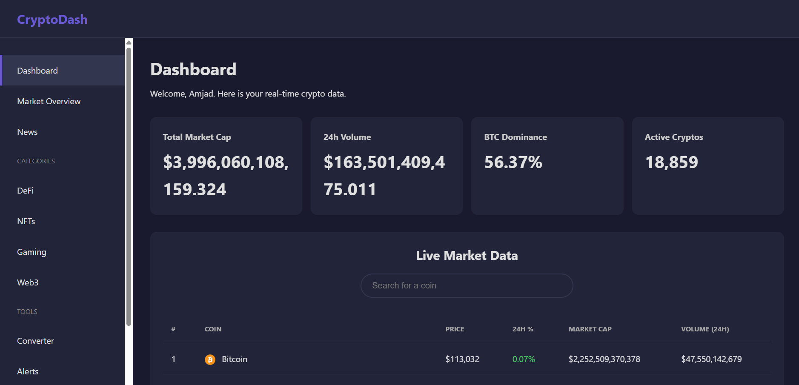

# 🚀 CryptoDash

**CryptoDash** is a real-time cryptocurrency dashboard web application that delivers instant access to market analytics, live prices, and trending crypto data in a modern, user-friendly interface.

---

## 📺 Demo Video

---

## ✨ Features

- Real-time display of total market cap, 24h trading volume, BTC dominance, and active cryptocurrencies
- Live price, 24h % change, market cap, and volume for top coins
- Sections for DeFi, NFTs, Gaming, and Web3
- Tools for currency conversion and price alerts
- Dark mode, mobile-responsive layout
- Built with modern web standards for speed and accessibility

---

## ⚙️ Quick Start

| Step | Command |
|------|---------|
| Clone the repository | `git clone https://github.com/amjad-alii/CryptoDash.git` |
| Backend setup & run  | `cd crypto-backend` `mvn clean install` `java -jar target/*.jar` |
| Frontend view        | Open `index.html` in your browser |

Configure database in `application.properties` for Spring Boot (MySQL hosted on AWS RDS).

---

## 📦 Tech Stack

- **Frontend:** HTML, CSS, JavaScript
- **Backend:** Spring Boot (Java)
- **Database:** MySQL (AWS RDS)
- **Cloud Hosting:** AWS Elastic Beanstalk

---

---

## 🤝 Contributing

1. Fork this repo and clone your fork.
2. Create a new branch for your feature/bugfix.
3. Commit and push changes.
4. Open a pull request describing your update!

---

## 📝 License

This project is licensed under the MIT License.

---

Created and maintained by Amjad.

---

*Need help? Open a GitHub issue or connect via [YouTube Demo Video](https://youtu.be/vTLkbKsooak) for walkthroughs and Q&A.*

